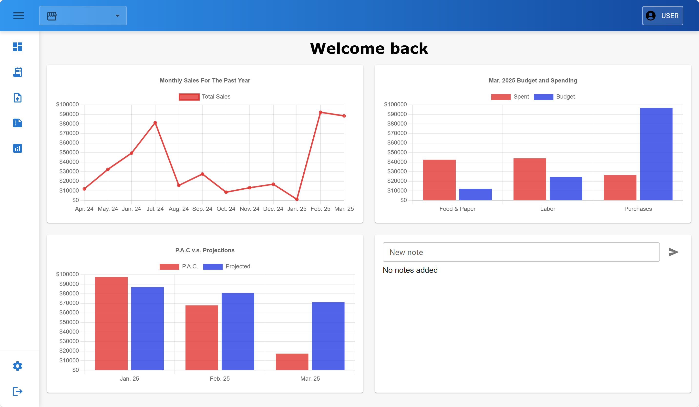
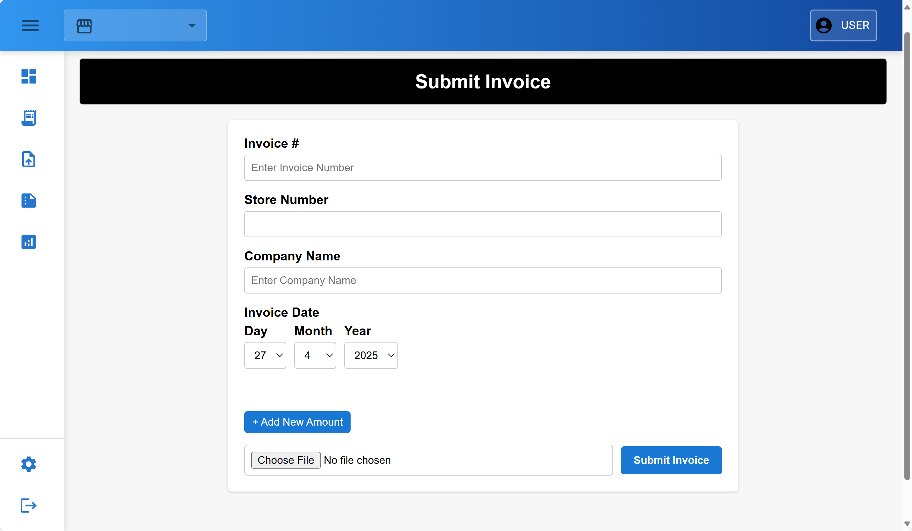
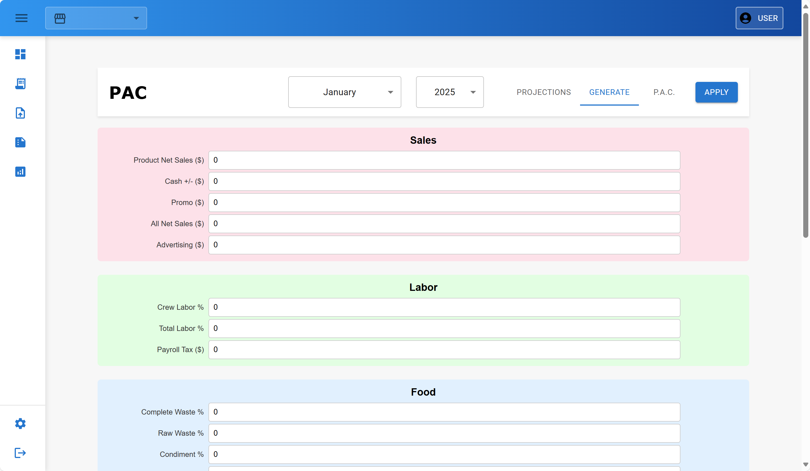

<a id="top"></a>

<br />

<!-- Project logo. -->
<div align="center">
  <a href="https://github.com/JoeyBlount/PAC-Pro">
    
  </a>
</div>

<br />

## About This Project

<!-- About this project text below -->
<p>PAC Pro is a web program which aims replaces the analog way invoicing that our client is currently using with a digital system. This program will help streamline invoice processing and help automatically generate profits after controllables based on the data. No more needing to juggle stacks of paper looking for a specific invoice and long wait times to see how store performing. The custom program mirrors the familiar paper based process allowing minimal retraining and simplicity for non-tech savvy staff members.</p>

### Built with

<!-- List tools used for this project -->

 &nbsp;  &nbsp;  &nbsp;  &nbsp; 

### Screenshots

<!-- Inset example Screens images -->

 &nbsp;  &nbsp; 

<p align="right"> (<a href="#top">Back to Top</a>) </p>

## Getting Started

<!-- How to set up text below -->

### Prerequisites

- **Node.js** (v16 or higher) - https://nodejs.org/en
- **Python** (v3.11 or higher) - https://www.python.org/downloads/
- **Firebase Project** with Firestore enabled
- **Google Cloud Service Account** with Firestore permissions

### System Architecture

This project consists of:

- **Frontend**: React application with Material-UI components
- **Backend**: Python FastAPI server for PAC calculations and data processing
- **Database**: Google Firestore for data storage
- **Authentication**: Microsoft/Google OAuth integration

### Setting Up

#### 1. Clone the Repository

```sh
git clone https://github.com/JoeyBlount/PAC-Pro.git
cd PAC-Pro
```

#### 2. Firebase Setup

1. Create a Firebase project at https://console.firebase.google.com
2. Enable Firestore Database
3. Create a service account:
   - Go to Project Settings > Service Accounts
   - Click "Generate new private key"
   - Download the JSON file
4. Place the service account JSON file in the project root as `firebase-service-account.json`
5. Update Firestore security rules to allow your application access

#### 3. Backend Setup (Python FastAPI)

```sh
# Navigate to backend directory
cd server/python_backend

# Install Python dependencies
pip install -r requirements.txt

# Install Firebase dependencies
pip install -r firebase_requirements.txt

# Start the backend server
python -c "import uvicorn; uvicorn.run('main:app', host='127.0.0.1', port=5140, log_level='info')"
```

The backend will be available at `http://localhost:5140`

#### 4. Frontend Setup (React)

```sh
# Navigate to client directory
cd client

# Install dependencies
npm install --legacy-peer-deps

# Start the development server
npm start
```

The frontend will be available at `http://localhost:3000`

#### 5. Generate Test Data (Optional)

To populate the system with test data:

```sh
# From the python_backend directory
python firebase_data_generator.py
python generate_projections_data.py
```

This will create:

- 8 test stores with complete information
- 12 months of PAC actual data for 2025
- 12 months of PAC projections data for 2025

### Environment Configuration

#### Frontend Environment Variables

Create a `.env` file in the `client` directory:

```env
REACT_APP_FIREBASE_API_KEY=your_firebase_api_key
REACT_APP_FIREBASE_AUTH_DOMAIN=your_project.firebaseapp.com
REACT_APP_FIREBASE_PROJECT_ID=your_project_id
REACT_APP_FIREBASE_STORAGE_BUCKET=your_project.appspot.com
REACT_APP_FIREBASE_MESSAGING_SENDER_ID=your_sender_id
REACT_APP_FIREBASE_APP_ID=your_app_id
REACT_APP_MICROSOFT_CLIENT_ID=your_microsoft_client_id
REACT_APP_BACKEND_URL=http://localhost:5140
```

#### Backend Configuration

Ensure `firebase-service-account.json` is in the project root with proper Firestore permissions.

### Key Features

#### PAC Calculation System

- **Actual vs Projected Analysis**: Compare actual performance against projections
- **Color-coded Results**: Red for underperformance, green for overperformance
- **Comprehensive Reporting**: Sales, Food & Paper, Labor, and Other Expenses
- **Print Functionality**: Generate formatted reports for printing

#### Data Management

- **Store Management**: Multi-store support with individual tracking
- **Monthly Data**: 12 months of historical and projected data
- **Real-time Updates**: Live data synchronization with Firestore

#### User Interface

- **Responsive Design**: Works on desktop and mobile devices
- **Material-UI Components**: Modern, accessible interface
- **Store Selection**: Easy switching between different store locations
- **Date Filtering**: Month and year selection for data analysis

### API Endpoints

#### PAC Data

- `GET /api/pac/{entity_id}/{year_month}` - Get actual PAC data
- `GET /api/projections/{entity_id}/{year_month}` - Get projected PAC data

#### Store Management

- `GET /api/stores` - Get all stores
- `POST /api/stores` - Create new store
- `PUT /api/stores/{store_id}` - Update store information

### Troubleshooting

#### Backend Issues

- **Port 5140 in use**: Kill existing Python processes with `taskkill /F /IM python.exe`
- **Firebase connection errors**: Verify service account JSON file and permissions
- **Import errors**: Ensure all Python dependencies are installed

#### Frontend Issues

- **Build errors**: Try `npm install --legacy-peer-deps` and clear node_modules
- **Authentication issues**: Verify Microsoft/Google OAuth configuration
- **Data not loading**: Check backend server is running and accessible

#### Common Solutions

```sh
# Clear npm cache
npm cache clean --force

# Reinstall dependencies
rm -rf node_modules package-lock.json
npm install --legacy-peer-deps

# Restart backend
taskkill /F /IM python.exe
python -c "import uvicorn; uvicorn.run('main:app', host='127.0.0.1', port=5140, log_level='info')"
```

<p align="right"> (<a href="#top">Back to Top</a>) </p>

## Project Timeline

<table>
  <thead>
    <tr>
      <th>Sprint</th>
      <th>Dates</th>
      <th>Goals / Deliverables</th>
    </tr>
  </thead>
  <tbody>
    <tr>
      <td>Sprint 5</td>
      <td>Sep 29 – Oct 12</td>
      <td>Connect all PAC pages to database, finalize database, Invoice OCR/AI Scanner Feature, Finish implementing all P.A.C. Calculations, Rework Projections Page</td>
    </tr>
    <tr>
      <td>Sprint 6</td>
      <td>Oct 13 – Oct 26</td>
      <td>Complete Locking functionality for finalized Months, Connect Dashboard to Database, Complete Roles and Permissions, Rework Account Page</td>
    </tr>
    <tr>
      <td>Sprint 7</td>
      <td>Oct 27 – Nov 9</td>
      <td>Complete additional features (e.g., darkmode, announcements, deadlines, etc.); finalize styling, Complete Testing on all previous features, Website Security/Data protection</td>
    </tr>
    <tr>
      <td>Sprint 8</td>
      <td>Nov 10 – Nov 24</td>
      <td>Conduct final bug fixes, polish UI/UX, and prepare presentation/demo</td>
    </tr>
  </tbody>
</table>

<p align="right"> (<a href="#top">Back to Top</a>) </p>

## Testing

<!-- Reserve for 191 -->

<p align="right"> (<a href="#top">Back to Top</a>) </p>

## Deployment

<!-- Reserve for 191 -->

<p align="right"> (<a href="#top">Back to Top</a>) </p>

## Developer Instructions

### Project Structure

```
PAC-Pro/
├── client/                     # React frontend
│   ├── src/
│   │   ├── pages/             # Main application pages
│   │   │   ├── pac/           # PAC calculation pages
│   │   │   ├── navBar/        # Navigation components
│   │   │   └── ...
│   │   ├── components/        # Reusable components
│   │   └── contexts/          # React contexts (Auth, Store)
│   ├── public/                # Static assets
│   └── package.json           # Frontend dependencies
├── server/
│   └── python_backend/        # Python FastAPI backend
│       ├── main.py            # FastAPI application entry point
│       ├── routers.py         # API route definitions
│       ├── models.py          # Pydantic data models
│       ├── services/          # Business logic services
│       │   ├── pac_calculation_service.py
│       │   ├── data_ingestion_service.py
│       │   └── account_mapping_service.py
│       ├── firebase_data_generator.py      # Test data generator
│       ├── generate_projections_data.py    # Projections data generator
│       ├── requirements.txt                # Python dependencies
│       └── firebase_requirements.txt       # Firebase-specific dependencies
├── firebase-service-account.json           # Firebase credentials (gitignored)
└── README.md
```

### Development Workflow

#### 1. Setting Up Development Environment

```sh
# Clone and setup
git clone https://github.com/JoeyBlount/PAC-Pro.git
cd PAC-Pro

# Backend setup
cd server/python_backend
pip install -r requirements.txt
pip install -r firebase_requirements.txt

# Frontend setup
cd ../../client
npm install --legacy-peer-deps
```

#### 2. Running in Development Mode

```sh
# Terminal 1: Start backend
cd server/python_backend
python -c "import uvicorn; uvicorn.run('main:app', host='127.0.0.1', port=5140, log_level='info', reload=True)"

# Terminal 2: Start frontend
cd client
npm start
```

#### 3. Code Organization

##### Frontend (React)

- **Components**: Located in `client/src/pages/` and `client/src/components/`
- **State Management**: Uses React Context API for global state
- **Styling**: Material-UI components with custom CSS
- **API Calls**: Centralized in service files

##### Backend (Python FastAPI)

- **Routes**: Defined in `routers.py`
- **Models**: Pydantic models in `models.py`
- **Services**: Business logic in `services/` directory
- **Data Processing**: PAC calculations in `pac_calculation_service.py`

#### 4. Adding New Features

##### Frontend Changes

1. Create new components in appropriate directories
2. Update routing in main App component
3. Add API calls to backend services
4. Update contexts if global state changes

##### Backend Changes

1. Add new routes in `routers.py`
2. Create/update Pydantic models in `models.py`
3. Implement business logic in service files
4. Update data ingestion if new data sources needed

#### 5. Testing

##### Frontend Testing

```sh
cd client
npm test
```

##### Backend Testing

```sh
cd server/python_backend
python -m pytest
```

#### 6. Data Management

##### Adding New Stores

1. Update `firebase_data_generator.py` with new store information
2. Run the generator to add to Firestore
3. Update frontend store selection if needed

##### Modifying PAC Calculations

1. Update calculation logic in `pac_calculation_service.py`
2. Modify data models if new fields needed
3. Update frontend display components
4. Test with existing data

#### 7. Deployment Considerations

##### Environment Variables

- Frontend: All environment variables must be prefixed with `REACT_APP_`
- Backend: Firebase service account JSON file required
- Production: Update CORS settings and authentication domains

##### Security

- Firebase service account JSON is gitignored
- OAuth client IDs should be environment-specific
- Firestore security rules should be properly configured

### Common Development Tasks

#### Adding a New PAC Calculation Field

1. Update `models.py` to include new field
2. Modify `pac_calculation_service.py` calculation logic
3. Update `data_ingestion_service.py` to handle new data
4. Add field to frontend display in `PacTab.js`
5. Update print functionality if needed

#### Modifying Store Data Structure

1. Update store model in backend
2. Modify `firebase_data_generator.py` for new structure
3. Update frontend store context and components
4. Regenerate test data if needed

#### Adding New Authentication Provider

1. Configure OAuth in Firebase console
2. Update frontend authentication context
3. Add provider-specific login components
4. Update backend user validation if needed

<p align="right"> (<a href="#top">Back to Top</a>) </p>

## Contributors

<h3>StackHats</h3>

<p><strong>Team Leader:</strong> Joseph Blount</p>

<p><strong>Developers:</strong></p>
<ul>
  <li>Joseph Blount</li>
  <li>Pavel Prokhorov</li>
  <li>Michelle Erickson</li>
  <li>Majd Hameed</li>
  <li>Chris Bozionelos</li>
  <li>Jamal Stanackzai</li>
  <li>Jason He</li>
  <li>Dylan Khon</li>
  <li>Kaden Bettencourt</li>
</ul>

<p align="right"> (<a href="#top">Back to Top</a>) </p>
