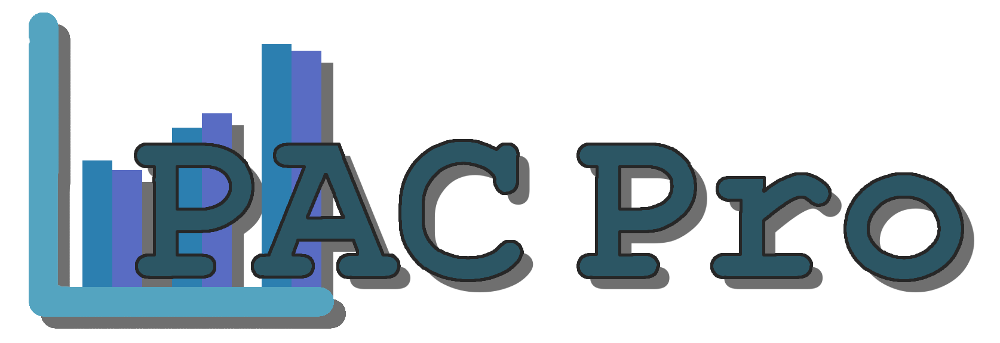

<!-- Old README for reference.

# PAC-PRO

## Quick Start

1. `cd client`
2. Run `npm install` (optional).
    a. `npm install -g live-server`
    b. `npm install @azure/msal-browser @azure/msal-react --legacy-peer-deps`
    c. `npm install firebase`
    d. `npm install chart.js react-chartjs-2 --legacy-peer-dep`
    e. `npm install html2canvas jspdf --legacy-peer-deps`
3. Run `npm start` or use the VS Code Live Server extension.
4. Open the site at `http://127.0.0.1:5500/public` or your chosen port.

## File Structure

- `public/`: All static HTML, CSS, JS
- `public/css/style.css`: Main stylesheet
- `public/js/*`: JavaScript files
- `index.html`: Root HTML

Feel free to modify for your actual front-end or API.

## -->

<!-- Start of new README formating -->

<a id="top"></a>

<br />

<!-- Project logo. Replace with offical one. -->
<div align="center">
  <a href="https://github.com/JoeyBlount/PAC-Pro">
    
  </a>
</div>

<br />

## About This Project

<!-- About this project text below --> 
<p>PAC Pro is a web program which aims replaces the analog way invoicing that our client is currently using with a digital system. This program will help streamline invoice processing and help automatically generate profits after controllables based on the data. No more needing to juggle stacks of paper looking for a specific invoice and long wait times to see how store performing. The custom program mirrors the familiar paper based process allowing minimal retraining and simplicity for non-tech savvy staff members.</p> 

### Built with 
<!-- List tools used for this project -->
 &nbsp;  &nbsp; 

### Screenshots
<!-- Inset example Screens images -->

 


<p align="right"> (<a href="#top">Back to Top</a>) </p>

## Getting Started

<!-- How to set up text below -->
### Prerequisites
Node.js is required to run this project locally. It can be found at the following link: https://nodejs.org/en

### Setting Up
The following instructions are for someone using VS Code. If you are not using VS Code, some extra steps may be required. Those extra steps will have to be determined by yourself and your development set up.

1. Change to client directory
```sh
cd client
```

2. Install required NPM packages using following command.
```sh
npm install --legacy-peer-deps
```

3. Start the server
```sh
npm start
```

4. Navigate to site using `http://localhost:3000` or your chosen port.


<p align="right"> (<a href="#top">Back to Top</a>) </p>

## Project Timeline

<!-- Insert Timeline for 191. Assignment Requirement. -->

<p align="right"> (<a href="#top">Back to Top</a>) </p>

## Testing

<!-- Reserve for 191 -->

<p align="right"> (<a href="#top">Back to Top</a>) </p>

## Deloyment

<!-- Reserve for 191 -->

<p align="right"> (<a href="#top">Back to Top</a>) </p>

## Developer Instructions

<!-- Reserve for 191 -->

<p align="right"> (<a href="#top">Back to Top</a>) </p>

## Contributors

<!-- Contributors below -->

<p align="right"> (<a href="#top">Back to Top</a>) </p>