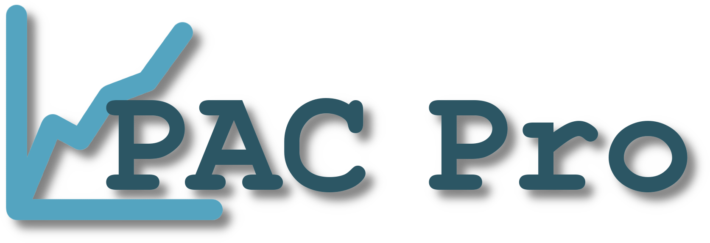

<!-- Old README for reference.

# PAC-PRO

## Quick Start

1. `cd client`
2. Run `npm install` (optional).
    a. `npm install -g live-server`
    b. `npm install @azure/msal-browser @azure/msal-react --legacy-peer-deps`
    c. `npm install firebase`
    d. `npm install chart.js react-chartjs-2 --legacy-peer-dep`
    e. `npm install html2canvas jspdf --legacy-peer-deps`
3. Run `npm start` or use the VS Code Live Server extension.
4. Open the site at `http://127.0.0.1:5500/public` or your chosen port.

## File Structure

- `public/`: All static HTML, CSS, JS
- `public/css/style.css`: Main stylesheet
- `public/js/*`: JavaScript files
- `index.html`: Root HTML

Feel free to modify for your actual front-end or API.

## -->

<!-- Start of new README formating -->

<a id="top"></a>

<br />

<div align="center">
  <a href="https://github.com/JoeyBlount/PAC-Pro">
    
  </a>
</div>

<br />

## About This Project

<!-- About this project text below --> 
<p>Just a bunch of awesome seniors banding together to create a awesome product for their client</p> 

### Built with 
<!-- List tools used for this project -->

<p align="right"> (<a href="#top">Back to Top</a>) </p>

## Getting Started

<!-- How to set up text below -->
### Prerequisites
Node.js is required to run this project. It can be found at the following link: https://nodejs.org/en

### Setting Up
1. Change to client directory
```sh
cd client
```

2. Install required NPM packages using following command.
```sh
npm install --legacy-peer-deps
```

3. Start the server
```sh
npm start
```

4. Navigate to site using `http://localhost:3000` or your chosen port.


<p align="right"> (<a href="#top">Back to Top</a>) </p>

## Project Timeline

<!-- Insert Timeline for 191. Assignment Requirement. -->

<p align="right"> (<a href="#top">Back to Top</a>) </p>

## Testing

<!-- Reserve for 191 -->

<p align="right"> (<a href="#top">Back to Top</a>) </p>

## Deloyment

<!-- Reserve for 191 -->

<p align="right"> (<a href="#top">Back to Top</a>) </p>

## Developer Instructions

<!-- Reserve for 191 -->

<p align="right"> (<a href="#top">Back to Top</a>) </p>

## Contributors

<!-- Contributors below -->

<p align="right"> (<a href="#top">Back to Top</a>) </p>