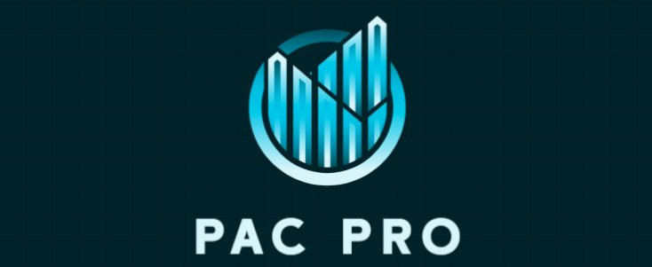

<a id="top"></a>

<br />

<!-- Project logo. Replace with offical one. -->
<div align="center">
  <a href="https://github.com/JoeyBlount/PAC-Pro">
    
  </a>
</div>

<br />

## About This Project

<!-- About this project text below --> 
<p>PAC Pro is a web program which aims replaces the analog way invoicing that our client is currently using with a digital system. This program will help streamline invoice processing and help automatically generate profits after controllables based on the data. No more needing to juggle stacks of paper looking for a specific invoice and long wait times to see how store performing. The custom program mirrors the familiar paper based process allowing minimal retraining and simplicity for non-tech savvy staff members.</p> 

### Built with 
<!-- List tools used for this project -->
 &nbsp;  &nbsp; 

### Screenshots
<!-- Inset example Screens images -->

 &nbsp;  &nbsp; 

<p align="right"> (<a href="#top">Back to Top</a>) </p>

## Getting Started

<!-- How to set up text below -->
### Prerequisites
Node.js is required to run this project locally. It can be found at the following link: https://nodejs.org/en

### Setting Up
The following instructions are for someone using VS Code. If you are not using VS Code, some extra steps may be required. Those extra steps will have to be determined by yourself and your development set up.

1. Change to client directory
```sh
cd client
```

2. Install required NPM packages using following command.
```sh
npm install --legacy-peer-deps
```

3. Start the server
```sh
npm start
```

4. Navigate to site using `http://localhost:3000` or your chosen port.


<p align="right"> (<a href="#top">Back to Top</a>) </p>

## Project Timeline

<table>
  <thead>
    <tr>
      <th>Sprint</th>
      <th>Dates</th>
      <th>Goals / Deliverables</th>
    </tr>
  </thead>
  <tbody>
    <tr>
      <td>Sprint 5</td>
      <td>Sep 29 – Oct 12</td>
      <td>Connect all PAC pages to database, finalize database, Invoice OCR/AI Scanner Feature, Finish implementing all P.A.C. Calculations, Rework Projections Page</td>
    </tr>
    <tr>
      <td>Sprint 6</td>
      <td>Oct 13 – Oct 26</td>
      <td>Complete Locking functionality for finalized Months, Connect Dashboard to Database, Complete Roles and Permissions, Rework Account Page</td>
    </tr>
    <tr>
      <td>Sprint 7</td>
      <td>Oct 27 – Nov 9</td>
      <td>Complete additional features (e.g., darkmode, announcements, deadlines, etc.); finalize styling, Complete Testing on all previous features, Website Security/Data protection</td>
    </tr>
    <tr>
      <td>Sprint 8</td>
      <td>Nov 10 – Nov 24</td>
      <td>Conduct final bug fixes, polish UI/UX, and prepare presentation/demo</td>
    </tr>
  </tbody>
</table>

<p align="right"> (<a href="#top">Back to Top</a>) </p>

## Testing

<!-- Reserve for 191 -->

<p align="right"> (<a href="#top">Back to Top</a>) </p>

## Deployment

<!-- Reserve for 191 -->

<p align="right"> (<a href="#top">Back to Top</a>) </p>

## Developer Instructions

<!-- Reserve for 191 -->

<p align="right"> (<a href="#top">Back to Top</a>) </p>

## Contributors

<h3>StackHats</h3>

<p><strong>Team Leader:</strong> Joseph Blount</p>

<p><strong>Developers:</strong></p>
<ul>
  <li>Joseph Blount</li>
  <li>Pavel Prokhorov</li>
  <li>Michelle Erickson</li>
  <li>Majd Hameed</li>
  <li>Chris Bozionelos</li>
  <li>Jamal Stanackzai</li>
  <li>Jason He</li>
  <li>Dylan Khon</li>
  <li>Kaden Bettencourt</li>
</ul>

<p align="right"> (<a href="#top">Back to Top</a>) </p>
